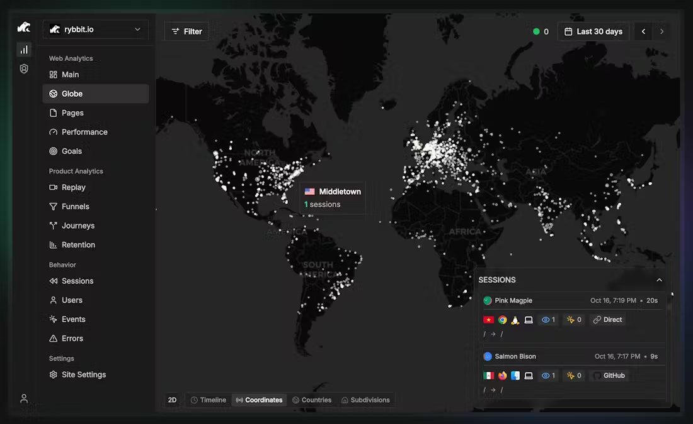

# Interactive Analytics Dashboard with 3D Globe

A modern, interactive analytics dashboard built with Next.js 14, featuring a 3D globe visualization for tracking user sessions and analytics data across the world.



## Features

- **Interactive 3D Globe**: Visualize user sessions from around the world with an auto-rotating 3D globe
- **Clickable Countries**: Click on any data point to see detailed country analytics
- **Real-time Session Tracking**: View recent sessions with browser, OS, and referrer information
- **Responsive Design**: Built with Tailwind CSS for a modern, dark-themed interface
- **Mock Analytics Data**: Pre-populated with realistic session data for demonstration

## Tech Stack

- **Next.js 14** - React framework with App Router
- **TypeScript** - Type-safe development
- **react-globe.gl** - 3D globe visualization powered by Three.js
- **Tailwind CSS** - Utility-first styling
- **Zustand** - Lightweight state management
- **Lucide React** - Beautiful icon library
- **date-fns** - Date formatting utilities

## Getting Started

### Prerequisites

- Node.js 18+ and npm installed

### Installation

1. Install dependencies:
```bash
npm install
```

2. Run the development server:
```bash
npm run dev
```

3. Open [http://localhost:3000](http://localhost:3000) in your browser

## How It Works

### Interactive Globe Component

The globe visualization (`components/Globe.tsx`) uses `react-globe.gl` to render:
- White dots representing user sessions
- Auto-rotation for visual appeal
- Click handlers to select countries
- Hover tooltips showing city/country information

```typescript
// Example: Clicking a point
const handlePointClick = (point: any) => {
  const globePoint = point as GlobePoint;
  const countryData = aggregateCountryData(sessions);
  const country = countryData.get(globePoint.session.countryCode);

  if (country) {
    setSelectedCountry(country);
  }
};
```

### Country Information Modal

When you click on any session point on the globe:
1. The globe zooms to that country's location
2. A modal appears showing:
   - Total sessions from that country
   - Total pageviews
   - Average session duration
   - Top cities
   - Pages per session average

The modal component (`components/CountryInfoModal.tsx`) uses Zustand store for state management.

### Sessions Panel

The right sidebar shows recent sessions with:
- Anonymized names (e.g., "Pink Magpie")
- Country flags
- Browser and OS icons
- Session duration and pageview count
- Referrer source (Direct, GitHub, Google, etc.)
- Relative timestamps

### Mock Data

The dashboard includes realistic mock data (`data/mockSessions.ts`):
- 170+ sessions across 16 cities worldwide
- Concentrated clusters in major cities (New York, London, Tokyo, etc.)
- Randomized browser types, OS, and referrers
- Time-distributed sessions over the last 24 hours

## Project Structure

```
dashboard-map/
├── app/
│   ├── layout.tsx          # Root layout
│   ├── page.tsx            # Main dashboard page
│   └── globals.css         # Global styles
├── components/
│   ├── Globe.tsx           # 3D globe visualization
│   ├── GlobeControls.tsx   # View mode controls
│   ├── CountryInfoModal.tsx # Country details modal
│   ├── SessionsPanel.tsx   # Sessions list panel
│   ├── Sidebar.tsx         # Navigation sidebar
│   └── Header.tsx          # Top header bar
├── data/
│   └── mockSessions.ts     # Mock analytics data
├── store/
│   └── useStore.ts         # Zustand state management
├── types/
│   └── index.ts            # TypeScript type definitions
└── utils/
    └── countryData.ts      # Data aggregation utilities
```

## Customization

### Adding Real Analytics Data

Replace the mock data in `data/mockSessions.ts` with your own analytics:

```typescript
// Example: Fetch from your API
const sessions = await fetch('/api/analytics/sessions').then(r => r.json());
```

### Customizing the Globe

Modify `components/Globe.tsx` to change appearance:

```typescript
// Change globe texture
globeImageUrl="//your-custom-globe-texture.jpg"

// Adjust point colors
pointColor={() => '#your-color'}

// Modify rotation speed
globeEl.current.controls().autoRotateSpeed = 1.0;
```

### Adding Real-Time Updates

Integrate WebSocket or polling for live data:

```typescript
useEffect(() => {
  const interval = setInterval(async () => {
    const newSessions = await fetchLatestSessions();
    setSessions(prev => [...newSessions, ...prev]);
  }, 5000);

  return () => clearInterval(interval);
}, []);
```

## Key Components Explained

### 1. Globe Component
- Uses `react-globe.gl` for WebGL rendering
- Dynamically imported to avoid SSR issues
- Handles click and hover interactions
- Auto-rotates and zooms to selected countries

### 2. State Management (Zustand)
```typescript
interface DashboardState {
  selectedCountry: CountryData | null;
  selectedSession: Session | null;
  hoveredCountry: string | null;
  dateRange: string;
}
```

### 3. Data Aggregation
The `aggregateCountryData` utility consolidates session data by country:
- Counts sessions per country
- Calculates total pageviews
- Computes average duration
- Lists top cities

## Building for Production

```bash
npm run build
npm start
```

## Browser Support

- Chrome 90+
- Firefox 88+
- Safari 14+
- Edge 90+

Note: Requires WebGL support for 3D globe rendering.

## Performance Tips

1. **Limit session data**: Display only recent sessions (default: 170)
2. **Use dynamic imports**: Globe component is loaded client-side only
3. **Optimize point rendering**: Limit visible points for better FPS
4. **Lazy load panels**: Consider virtualizing the sessions list for 1000+ items

## Future Enhancements

- [ ] Timeline view to animate sessions over time
- [ ] Heatmap overlay for session density
- [ ] Filter by date range, browser, or referrer
- [ ] Export analytics reports
- [ ] Real-time WebSocket integration
- [ ] User journey visualization
- [ ] A/B test tracking

## License

MIT

## Contributing

Contributions are welcome! Feel free to open issues or submit pull requests.

---

Built with Next.js and react-globe.gl